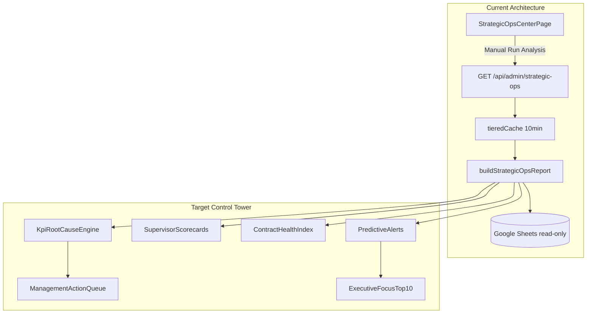

# Strategic Control Tower — Gap Analysis & Implementation Roadmap

## Executive verdict

The current **Strategic Operations Center** is a **batch reporting + data-trust audit platform**, not an operational control tower. It answers *what* happened in a selected date range; it does **not** systematically answer *why*, *who owns the loss*, *what to do today*, or *what happens if trends continue*.

**Core constraint (honored throughout):** All enhancements are **read-only analytics layers** on top of existing data pipelines. No changes to [`lib/strategicOps/talabatOpsMetrics.ts`](lib/strategicOps/talabatOpsMetrics.ts) formulas, Google Sheets writes, salary, recruitment logic, or Talabat calculation parity.

**Primary code surface today:**

| Layer | Path |
|-------|------|
| UI | [`app/admin/strategic-ops/page.tsx`](app/admin/strategic-ops/page.tsx) (~1,400 lines, inline components) |
| API | [`app/api/admin/strategic-ops/route.ts`](app/api/admin/strategic-ops/route.ts) |
| Report builder | [`lib/strategicOps/buildReport.ts`](lib/strategicOps/buildReport.ts) (`StrategicOpsReport`, `buildStrategicOpsReport()`) |
| Talabat KPIs | [`lib/strategicOps/talabatOpsMetrics.ts`](lib/strategicOps/talabatOpsMetrics.ts) |
| Truth/risk | [`lib/strategicOps/truthEngine.ts`](lib/strategicOps/truthEngine.ts) |
| Rule insights | `generateInsights()` in [`buildReport.ts`](lib/strategicOps/buildReport.ts) L1011–1056 |



---

## Deliverable 1: `STRATEGIC_CONTROL_TOWER_GAP_ANALYSIS.md`

**Proposed location:** [`docs/enterprise-readiness/STRATEGIC_CONTROL_TOWER_GAP_ANALYSIS.md`](docs/enterprise-readiness/STRATEGIC_CONTROL_TOWER_GAP_ANALYSIS.md)

### Current-state summary (what exists)

**Displayed KPIs (Talabat mode — default UI):**
- Headcount, Active Riders (avg daily), No Show (avg daily), Actual Hours, Target Hours, Achievement %, Avg Hours/Active Rider, Utilization %
- Per-KPI **formula audit traces** via expandable `TalabatKpiCard` (formula/numerator/denominator/source — not causal decomposition)

**Supporting analytics (mostly hidden behind "Show Strategic Analysis"):**
- Lost hours breakdown (3 categories: no operation, weak operation, resignations) — [`buildReport.ts`](lib/strategicOps/buildReport.ts) L1298–1338
- Supervisor table with KPI columns — L1346–1422
- STI/ORPS/RDE + 4 alert types — [`truthEngine.ts`](lib/strategicOps/truthEngine.ts)
- Growth scenarios A–D (what-if, not predictive alerts) — L1558–1624
- Rule-based `aiInsights` (7 Arabic text blocks, no priority/impact/recovery hours) — L1011–1056
- Fleet operational health score (0–100) — not per-contract, not per-KPI

**Data dimensions available read-only:**
- **Supervisor:** full aggregation exists
- **City/Zone:** filter via [`lib/zones.ts`](lib/zones.ts) + `rider.region` / `supervisor.region` — **no zone rollup table**
- **Contract:** **NOT in Strategic Ops** — exists only in Shifts legacy (`contract_name`, `employee_id` in [`lib/shiftAutomationLegacy.ts`](lib/shiftAutomationLegacy.ts)); **Rider model has no contract field** ([`lib/adminService.ts`](lib/adminService.ts) L35–44)

---

### Phase-by-phase gap matrix

#### Phase 1 — Root Cause Analysis (per KPI)

| Requirement | Current | Gap severity |
|-------------|---------|--------------|
| Why is KPI at this value? | Formula audit trace only | **High** — explains calculation, not drivers |
| Top contributing factors | Lost hours has 3 fleet categories; no per-KPI driver tree | **High** |
| Top supervisors/contracts/cities | Supervisor table exists; no ranked loss contributors; **no contract**; **no city rollup** | **Critical** (contract), **High** (city) |
| Trend vs 7/14/30 days | User picks arbitrary range; **no automatic prior-period comparison** | **High** |
| Achievement=66% example decomposition (missing hours/riders/shifts, top 10 loss lists) | Partial: `hoursRoadmap.dailyGap`, `growthOpportunities`, `bottom20ByHours`; **no shift-level gap**; **no top-10 supervisors/riders/contracts by lost target hours** | **Critical** |

**Example gap — Achievement decomposition missing today:**

```typescript
// talabatOpsMetrics.ts — achievement is a ratio only
achievementPercent = pct(actualHours, targetHours);
// No: gapHours, gapRiders, gapShifts, ranked contributors
```

**Existing building blocks to reuse (read-only):**
- `SupervisorOpsRow` metrics — [`buildReport.ts`](lib/strategicOps/buildReport.ts) L91–123
- `utilization.top20ByHours` / `bottom20ByHours` — L1254–1259
- `lostHours.breakdown` — L1319–1338
- `talabatOperations.dailySeries` — per-day active/noShow/hours/target in [`talabatOpsMetrics.ts`](lib/strategicOps/talabatOpsMetrics.ts)

---

#### Phase 2 — Management Actions

| Requirement | Current | Gap |
|-------------|---------|-----|
| Priority (Critical/High/Medium/Low) | None | **Critical** |
| Expected recovered hours | Growth scenarios have hours; not tied to actionable items | **High** |
| Recommended action text | `aiInsights` = unstructured Arabic prose | **High** |
| Action queue / assignable items | None | **Critical** |

`generateInsights()` today produces narrative only — no structured `ManagementAction[]`.

---

#### Phase 3 — Supervisor Performance Intelligence

| Requirement | Current | Gap |
|-------------|---------|-----|
| Scorecard metrics (team size, active, no-show %, achievement, utilization, lost hours, lost target) | Table has most KPIs; **missing lost hours & lost target per supervisor** | **Medium** |
| Top/bottom performer rankings | `bestSupervisor`/`worstSupervisor` by productivityScore; STI/ORPS separate rankings | **Medium** — not unified scorecard |
| Bottom performer "why / what's missing / fix" | `supervisorRisk.factors` + STI breakdown partially; **no dedicated bottom-performer narrative** | **High** |

---

#### Phase 4 — Contract Health

| Requirement | Current | Gap |
|-------------|---------|-----|
| Health score 0–100 per contract | None | **Critical** |
| Classification (Excellent/Good/Risk/Critical) | Fleet `operationalHealth` only | **Critical** |
| Root causes per contract | None | **Critical** |

**Data prerequisite:** Contract dimension requires a **read-only enrichment layer** joining rider codes to Shifts/Rooster `employee_id → contract_name` (no Sheet modification). Fallback Phase 4A: supervisor/zone proxy until join coverage is audited.

---

#### Phase 5 — Predictive Alerts

| Requirement | Current | Gap |
|-------------|---------|-----|
| "If trend continues, miss X hours this week" | `hoursRoadmap` is static gap, not trend extrapolation | **High** |
| "No-show unchanged → achievement drops to Y%" | Not implemented | **High** |
| "If N inactive return → achievement becomes Z%" | Growth scenario C is closest (manual scenario, not alert) | **Medium** |

Existing `TruthCriticalAlert` types (supervisor collapse, dependency, ghost leakage, SPOF) are **risk flags**, not **forward-looking forecasts**.

---

#### Phase 6 — Executive Summary ("Where to focus today")

| Requirement | Current | Gap |
|-------------|---------|-----|
| Max 10 ranked actions by business impact | `aiInsights.focusThisWeek` = single paragraph | **Critical** |
| Recoverable hours per action | Not ranked or quantified in UI | **Critical** |

**UX gap:** Default mode (`talabat_ops`) shows KPI cards + supervisor table; executive action list is buried in hidden strategic sections.

---

#### Phase 7 — Technical Audit (Console errors)

Covered in Deliverable 3 (static audit). Key finding: **CSP likely blocks Sentry ingest** when DSN is active.

---

### Structural UX gaps (cross-cutting)

1. **Manual "Run Analysis"** — not a live control tower ([`page.tsx`](app/admin/strategic-ops/page.tsx) L209–227)
2. **30–120s report build** — operational directors need sub-minute refresh or pre-computed snapshots
3. **Reporting-first information architecture** — 15+ audit sections vs. 1 action-first landing
4. **No KPI → contributor drill-down** — tables exist but aren't linked from KPI cards
5. **Shifts module isolated** — shift/contract data not wired to Strategic Ops KPIs

---

## Deliverable 2: `CONTROL_TOWER_IMPLEMENTATION_PLAN.md`

**Proposed location:** [`docs/enterprise-readiness/CONTROL_TOWER_IMPLEMENTATION_PLAN.md`](docs/enterprise-readiness/CONTROL_TOWER_IMPLEMENTATION_PLAN.md)

### Implementation principles

1. **New modules, not formula edits** — add `lib/strategicOps/controlTower/` namespace
2. **Extend `StrategicOpsReport` type** with new optional sections; keep existing fields unchanged
3. **Compose from existing aggregates** — call current Talabat/supervisor/lost-hours outputs as inputs
4. **Single API response** — extend `GET /api/admin/strategic-ops` payload (same route, additive JSON)
5. **UI: new Control Tower tab/sections** at top of page — default landing, audits remain collapsible

### Proposed new modules

```
lib/strategicOps/controlTower/
  periodComparison.ts      # 7/14/30-day delta vs current period
  kpiRootCause.ts          # Per-KPI driver trees + top-10 contributors
  achievementDecomposition.ts  # gap hours/riders/shifts + ranked loss
  managementActions.ts     # Priority, impact, action, recovery hours
  supervisorScorecard.ts   # Unified rankings + bottom-performer diagnostics
  contractEnrichment.ts    # Read-only rider→contract join from Shifts data
  contractHealth.ts        # 0-100 score + classification + root causes
  predictiveAlerts.ts      # Linear trend extrapolation + scenario alerts
  executiveFocus.ts        # Top-10 ranked actions aggregator
  types.ts
  controlTower.test.ts
```

### Phase implementation sequence

#### Sprint 1 — Foundation (Phases 1 + 6 partial)

**Backend:**
- Add `periodComparison` — run `buildStrategicOpsReport` logic on **prior windows** (7/14/30 days ending at `startDate - 1`) using same filters; return `{ kpi, current, prior, delta, deltaPercent }[]`
- Add `achievementDecomposition` — compute:
  - `gapHours = targetHours - actualHours`
  - `gapRiders = headcount - activeRiders` (avg daily)
  - `gapShifts` = sum of daily `(scheduledRiders - activeRiders)` from `dailySeries` (proxy for missing shift coverage)
  - Top 10 supervisors/riders by `lostTargetHours = max(0, supervisorTarget - supervisorActual)`
- Add `kpiRootCause` — for each of 7 KPIs, attach `{ summaryAr, factors[], topSupervisors[], topCities[], trend }`

**UI ([`page.tsx`](app/admin/strategic-ops/page.tsx)):**
- New top section: **"Control Tower — Focus Today"** (placeholder until Sprint 2 actions)
- Expand each `TalabatKpiCard` with **"Why?" panel** showing root cause + top contributors + 7/14/30 trend chips
- Add **Achievement Decomposition** panel with top-10 tables

**Performance mitigation:** Compute period comparisons from already-loaded daily series + scoped aggregates in-process (avoid 3× full report builds). Cache key extension: `strategic-ops:...:controlTower:v1`.

#### Sprint 2 — Management Actions + Executive Focus (Phases 2 + 6)

**Backend — `managementActions.ts`:**
Generate structured actions from deterministic rules (no LLM):

| Signal source | Example action | Priority heuristic |
|---------------|----------------|-------------------|
| Supervisor no-show > fleet avg + 2σ | "Call supervisor X today" | Critical if >15 no-shows |
| Supervisor achievement gap | "Supervisor X missing Y hours/day" | High |
| Inactive rider count by supervisor | "Reactivate N riders under X" | Medium |
| Contract/supervisor headcount gap | "Recruitment required — Z riders" | High |
| Resignation spike | "Retention intervention" | Medium |

Each action: `{ id, priority, entityType, entityId, entityName, problemAr, actionAr, expectedRecoveryHours, evidence }`

**Backend — `executiveFocus.ts`:** Sort all actions by `expectedRecoveryHours DESC`, cap at 10.

**UI:** Action cards with priority badges, recovery hours, one-click copy for supervisor WhatsApp/call list.

#### Sprint 3 — Supervisor Scorecards (Phase 3)

**Backend — `supervisorScorecard.ts`:**
Extend supervisor rows (analytics-only computed fields, not changing `SupervisorOpsRow` risk formula):
- `lostHoursDaily`, `lostTargetDaily`, `noShowPercent`, `scorecardRank`
- `bottomPerformerDiagnosis: { whyAr, missingAr, fixAr }` from template rules using existing risk factors + lost hours + inactive count

**UI:** Dedicated scorecard section with Top 5 / Bottom 5 tabs; bottom performers expand diagnosis.

#### Sprint 4 — Contract Health (Phase 4)

**Step 4A — Data audit (read-only):**
- Script: `scripts/audit-rider-contract-coverage.ts` — match `المناديب.code` ↔ Shifts `employee_id`, report match rate by zone
- Document coverage in gap analysis appendix

**Step 4B — Enrichment (no Sheet writes):**
- `contractEnrichment.ts` reads Shifts spreadsheet or cached rooster export via existing [`lib/googleSheetsAuth.ts`](lib/googleSheetsAuth.ts) shifts ID
- Map riders → contract; unmapped riders → `"Unknown"` bucket

**Step 4C — `contractHealth.ts`:**
Score (0–100) weighted composite (reuse fleet health pattern from `computeOperationalHealth`):
- Achievement (30%), Utilization (25%), Attendance inverse of no-show (20%), Stability inverse of attrition (15%), Data quality (10%)
- Classify: 85+ Excellent, 70–84 Good, 50–69 Risk, <50 Critical
- Attach root causes from contract-level aggregation of lost hours categories

**UI:** Contract health grid with drill-down.

#### Sprint 5 — Predictive Alerts (Phase 5)

**Backend — `predictiveAlerts.ts`:**
- Linear regression on last 14 days of `dailySeries` for hours, no-show, achievement
- Alert templates:
  - `weekly_miss_hours = dailyGap * 7` if slope negative
  - `achievement_forecast = extrapolated achievement at day+7`
  - `reactivation_scenario`: reuse growth scenario C math with explicit threshold (e.g. 15 riders)
- Return `{ severity, messageAr, metric, currentValue, projectedValue, horizonDays, confidence }`

**UI:** Alert banner strip above KPI cards (max 8 visible).

#### Sprint 6 — Polish + Phase 7 fixes

- Fix CSP for Sentry (see Deliverable 3)
- Add `ErrorBoundary` → `Sentry.captureException` in strategic-ops page
- Export control tower sections in [`clientExport.ts`](lib/strategicOps/clientExport.ts)
- Load test authenticated strategic-ops with control tower enabled ([`scripts/load-test-strategic-ops.ts`](scripts/load-test-strategic-ops.ts))

### Files to modify (additive only)

| File | Change |
|------|--------|
| [`lib/strategicOps/buildReport.ts`](lib/strategicOps/buildReport.ts) | Import control tower modules; append new report sections at end of pipeline |
| [`lib/strategicOps/buildReport.ts`](lib/strategicOps/buildReport.ts) `StrategicOpsReport` type | Add `controlTower?: ControlTowerReport` |
| [`app/admin/strategic-ops/page.tsx`](app/admin/strategic-ops/page.tsx) | New Control Tower UI sections (default visible) |
| [`lib/strategicOps/clientExport.ts`](lib/strategicOps/clientExport.ts) | Export new sheets/tabs |
| [`lib/securityHeaders.ts`](lib/securityHeaders.ts) | CSP `connect-src` for Sentry |
| [`lib/strategicOps/labelsAr.ts`](lib/strategicOps/labelsAr.ts) | Arabic labels for new sections |

### Files explicitly NOT modified

- [`lib/strategicOps/talabatOpsMetrics.ts`](lib/strategicOps/talabatOpsMetrics.ts) — Talabat formulas
- [`lib/googleSheets.ts`](lib/googleSheets.ts) write paths
- Salary, recruitment service logic
- Any Sheet tab structure

### Success criteria (acceptance)

- Each of 7 KPIs shows: why, top 3 factors, top supervisors/cities, 7/14/30-day trend
- Achievement view shows gap hours/riders/shifts + top 10 loss lists
- ≥5 auto-generated management actions with priority + recovery hours
- Supervisor scorecards with top/bottom 5 + bottom diagnosis
- Contract health for all mapped contracts (or documented coverage %)
- ≥3 predictive alerts when trends are declining
- Executive focus shows ≤10 ranked actions
- Zero changes to Talabat KPI numeric outputs for same inputs

### Estimated effort

| Sprint | Scope | Effort |
|--------|-------|--------|
| 1 | Root cause + period comparison + achievement decomposition UI | 5–7 days |
| 2 | Management actions + executive focus | 3–4 days |
| 3 | Supervisor scorecards | 2–3 days |
| 4 | Contract enrichment + health | 4–5 days (depends on join coverage) |
| 5 | Predictive alerts | 2–3 days |
| 6 | CSP/Sentry + export + load test | 2 days |
| **Total** | | **~18–24 dev days** |

---

## Deliverable 3: `CONSOLE_ERROR_AUDIT.md`

**Proposed location:** [`docs/enterprise-readiness/CONSOLE_ERROR_AUDIT.md`](docs/enterprise-readiness/CONSOLE_ERROR_AUDIT.md)

**Audit method:** Static code analysis + CSP header review + Sentry config review. **Live browser console capture was not executed in this planning pass** — document recommends a 15-minute production UAT checklist post-deploy.

### Findings table (static audit)

| # | Error / Warning | Classification | Root cause | Production impact | Fix | Priority |
|---|-----------------|----------------|------------|-------------------|-----|----------|
| 1 | `Refused to connect to https://*.ingest.sentry.io` (CSP) | **Critical** | [`lib/securityHeaders.ts`](lib/securityHeaders.ts) L23 — `connect-src` omits Sentry ingest domains | **Error monitoring silently fails** when `NEXT_PUBLIC_SENTRY_DSN` is set; ops blind to client errors | Add `https://*.ingest.sentry.io https://*.sentry.io` to `connect-src`, OR configure Sentry tunnel route in `next.config.js` | **P0** |
| 2 | Sentry events blocked (network tab: blocked:csp) | **Critical** | Same as #1 | No client-side error visibility in Sentry dashboard | Same fix as #1 | **P0** |
| 3 | `A listener indicated an asynchronous response...` (message channel) | Informational | Typically **browser extensions** (React DevTools, ad blockers), not app code — no matches in repo | None on production users without extensions | Document as external; no code change | **P4** |
| 4 | `[Violation] 'setTimeout' handler took Xms` | Warning | Heavy Recharts render + large `StrategicOpsReport` JSON on [`page.tsx`](app/admin/strategic-ops/page.tsx) | UI jank on low-end devices when strategic sections expanded | Lazy-mount strategic sections; virtualize large tables; memoize chart data | **P2** |
| 5 | `[Violation] Forced reflow while executing JavaScript` | Warning | Recharts layout + ResponsiveContainer in multiple sections | Minor perf on report load | Defer chart render until section visible (`IntersectionObserver`) | **P3** |
| 6 | React Strict Mode double-fetch (dev only) | Informational | `reactStrictMode: true` in [`next.config.js`](next.config.js) L5 | Dev-only duplicate API calls | Expected; no fix needed | **P4** |
| 7 | Strategic Ops API timeout (504) | **Critical** (conditional) | `maxDuration: 120` on route; full sheet reads in `buildReport` | Report fails for large date ranges / 5000+ riders | Pre-compute via cron snapshot; extend cache; mirror read path | **P1** |
| 8 | `Error caught by boundary` without Sentry | Warning | [`components/ErrorBoundary.tsx`](components/ErrorBoundary.tsx) L24 — `console.error` only | React errors not captured in Sentry | Add `Sentry.captureException(error)` in `componentDidCatch` | **P2** |
| 9 | Google Sheets read failure → empty data | Warning | [`lib/googleSheets.ts`](lib/googleSheets.ts) returns `[]` on error | KPIs show zeros without clear user-facing error | Strategic Ops UI already shows query error; add explicit "data source failed" banner | **P2** |
| 10 | Redis optional warnings | Informational | [`lib/redisCache.optional.ts`](lib/redisCache.optional.ts) — `console.warn` on Redis failure | Falls back to in-memory cache; reduced cross-instance consistency | Monitor Redis; already documented in enterprise reports | **P3** |

### CSP current vs required

**Current `connect-src`** ([`securityHeaders.ts`](lib/securityHeaders.ts) L23):
```
'self' https://vitals.vercel-insights.com https://*.googleapis.com https://*.vercel.app wss://*.vercel.app
```

**Required addition for Sentry:**
```
https://*.ingest.sentry.io https://*.sentry.io
```

**Alternative (preferred by Sentry for strict CSP):** Enable `tunnelRoute: '/monitoring'` in `withSentryConfig` so events POST to same-origin `/monitoring` (already allowed by `'self'`).

### Recommended production UAT checklist (to append to audit doc)

1. Open `/admin/strategic-ops` in Chrome Incognito (no extensions)
2. Run analysis for 30-day range; capture Console + Network tab
3. Filter Network for `ingest.sentry` — confirm not blocked
4. Trigger test error via `/api/health/sentry-probe` (admin auth)
5. Confirm Sentry Issues dashboard receives event
6. Expand all strategic sections; note Violation warnings
7. Repeat with zone filter + single supervisor filter

---

## Post-approval actions

Upon plan confirmation, write the three markdown files to [`docs/enterprise-readiness/`](docs/enterprise-readiness/) with full expanded content (gap tables, mermaid diagrams, sprint acceptance criteria, and console audit evidence templates). **No code implementation until a separate implementation approval.**
