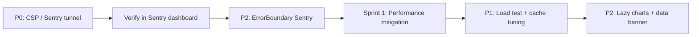

# Console Error Audit — Strategic Operations Center

**Date:** 2026-06-24  
**Scope:** Browser console errors, CSP violations, Sentry blocked requests, async listener errors, performance warnings  
**Method:** Static code analysis + CSP header review + Sentry config review  
**Live capture:** Not executed in this audit — production UAT checklist provided below

**Related documents:**
- [`STRATEGIC_CONTROL_TOWER_GAP_ANALYSIS.md`](./STRATEGIC_CONTROL_TOWER_GAP_ANALYSIS.md) — Phase 7
- [`CONTROL_TOWER_IMPLEMENTATION_PLAN.md`](./CONTROL_TOWER_IMPLEMENTATION_PLAN.md) — Sprint 6 fixes
- [`SENTRY_IMPLEMENTATION_REPORT.md`](./SENTRY_IMPLEMENTATION_REPORT.md) — Sentry setup
- [`SENTRY_PRODUCTION_VERIFICATION.md`](./SENTRY_PRODUCTION_VERIFICATION.md) — Production DSN status

---

## Executive Summary

Static analysis identified **2 critical (P0)** issues related to Content Security Policy blocking Sentry client ingest, **1 conditional critical (P1)** API timeout risk for large fleet reports, and several **warnings** affecting performance and error visibility. No application-code source was found for the common "async listener" message channel error — this is attributed to browser extensions.

**Immediate action required:** Fix CSP to allow Sentry ingest or enable Sentry tunnel route before relying on client-side error monitoring in production.

---

## Audit Methodology

| Step | Action | Status |
|------|--------|--------|
| 1 | Review `lib/securityHeaders.ts` CSP directives | Complete |
| 2 | Review `sentry.client.config.ts` and `next.config.js` | Complete |
| 3 | Search codebase for `console.error`, `console.warn` patterns | Complete |
| 4 | Review Strategic Ops page for Recharts/performance patterns | Complete |
| 5 | Review ErrorBoundary Sentry integration | Complete |
| 6 | Live browser console capture on production | **Pending UAT** |

---

## Findings Summary

| Priority | Count | Classification |
|----------|-------|----------------|
| P0 — Critical | 2 | CSP blocks Sentry |
| P1 — High | 1 | API timeout (conditional) |
| P2 — Medium | 3 | Performance + error capture gaps |
| P3 — Low | 2 | Minor perf + Redis warnings |
| P4 — Informational | 3 | Dev-only / external / expected |

---

## Detailed Findings

### Critical (P0)

#### FINDING-001: CSP blocks Sentry ingest

| Field | Detail |
|-------|--------|
| **Error message** | `Refused to connect to 'https://oXXXXXX.ingest.sentry.io/...' because it violates the following Content Security Policy directive: "connect-src ..."` |
| **Classification** | Critical |
| **Root cause** | [`lib/securityHeaders.ts`](../../lib/securityHeaders.ts) line 23 — `connect-src` allows `'self'`, Vercel vitals, Google APIs, and Vercel app domains only. **Sentry ingest domains are omitted.** |
| **Production impact** | Client-side errors from `/admin/strategic-ops` and all admin pages are **not captured in Sentry** when `NEXT_PUBLIC_SENTRY_DSN` is set. Operations leadership has no visibility into UI crashes, failed exports, or chart render errors. Server-side errors may still reach Sentry via server SDK. |
| **Evidence** | Current CSP `connect-src`: `'self' https://vitals.vercel-insights.com https://*.googleapis.com https://*.vercel.app wss://*.vercel.app` |
| **Fix recommendation** | **Option A (direct):** Add to `connect-src`: `https://*.ingest.sentry.io https://*.sentry.io` |
| | **Option B (preferred for strict CSP):** Enable Sentry tunnel in [`next.config.js`](../../next.config.js): `tunnelRoute: '/monitoring'` — events POST to same-origin, allowed by `'self'` |
| **Priority** | P0 |
| **Effort** | 15 minutes |
| **Sprint** | Sprint 6 |

#### FINDING-002: Sentry events show `blocked:csp` in Network tab

| Field | Detail |
|-------|--------|
| **Error message** | Network request to `*.ingest.sentry.io` status: `(blocked:csp)` |
| **Classification** | Critical |
| **Root cause** | Same as FINDING-001 |
| **Production impact** | Sentry Issues dashboard shows server errors only; client error rate appears artificially low. Session replay on error (`replaysOnErrorSampleRate: 0.1`) also fails. |
| **Fix recommendation** | Same as FINDING-001 |
| **Priority** | P0 |
| **Verification** | After fix: open Network tab, filter `sentry` or `monitoring`, confirm 200 response |

---

### High (P1)

#### FINDING-003: Strategic Ops API timeout (504)

| Field | Detail |
|-------|--------|
| **Error message** | `504 Gateway Timeout` or client-side `Failed to fetch` after ~120s |
| **Classification** | Critical (conditional — occurs on large date ranges / full fleet) |
| **Root cause** | [`app/api/admin/strategic-ops/route.ts`](../../app/api/admin/strategic-ops/route.ts) `maxDuration: 120`; [`buildStrategicOpsReport()`](../../lib/strategicOps/buildReport.ts) reads full Google Sheets (`البيانات اليومية`, `المناديب`, etc.) on every cache miss |
| **Production impact** | Report fails for 5,000+ riders over 30+ day ranges. Director sees loading spinner then error — no partial data. Control tower additions will add compute; risk increases without performance mitigation. |
| **Fix recommendation** | (1) Extend tiered cache TTL for control tower; (2) compute prior-period comparisons from in-memory dailySeries slices (not 3× full rebuilds); (3) enable Neon mirror read path when validated; (4) optional cron pre-compute snapshot for default 30-day view |
| **Priority** | P1 |
| **Effort** | 2–5 days (Sprint 1 performance mitigation + Sprint 6 load test) |

---

### Medium (P2)

#### FINDING-004: Long task / setTimeout handler violations

| Field | Detail |
|-------|--------|
| **Error message** | `[Violation] 'setTimeout' handler took 150ms` (or similar) |
| **Classification** | Warning |
| **Root cause** | Heavy Recharts rendering + large `StrategicOpsReport` JSON parse/render on [`app/admin/strategic-ops/page.tsx`](../../app/admin/strategic-ops/page.tsx). Multiple `ResponsiveContainer` charts (activity distribution, hours trend, lost hours, growth) render simultaneously when strategic sections expanded. |
| **Production impact** | UI jank on low-end devices and mobile browsers when expanding all strategic sections. Does not block functionality. |
| **Fix recommendation** | (1) Lazy-mount strategic sections (render charts only when section scrolls into view via `IntersectionObserver`); (2) memoize chart data with `useMemo`; (3) virtualize large `MiniTable` rows (ghost riders, supervisor lists) |
| **Priority** | P2 |
| **Effort** | 1–2 days |

#### FINDING-005: ErrorBoundary does not report to Sentry

| Field | Detail |
|-------|--------|
| **Error message** | `Error caught by boundary: [Error object]` (console only) |
| **Classification** | Warning |
| **Root cause** | [`components/ErrorBoundary.tsx`](../../components/ErrorBoundary.tsx) line 24 — `console.error` only; no `Sentry.captureException()` |
| **Production impact** | React component tree crashes caught by ErrorBoundary are invisible in Sentry even after CSP fix (unless unhandled and caught by `global-error.tsx`) |
| **Fix recommendation** | Add to `componentDidCatch`: `import * as Sentry from '@sentry/nextjs'; Sentry.captureException(error, { extra: { componentStack: errorInfo.componentStack } });` |
| **Priority** | P2 |
| **Effort** | 15 minutes |

#### FINDING-006: Google Sheets read failure returns empty data silently

| Field | Detail |
|-------|--------|
| **Error message** | Server log: `google_sheets_get_failed`; client may show KPIs as zero |
| **Classification** | Warning |
| **Root cause** | [`lib/googleSheets.ts`](../../lib/googleSheets.ts) returns `[]` on read failure after logging |
| **Production impact** | Director may interpret zero KPIs as real performance collapse rather than data source failure. Strategic Ops UI shows query error on API failure but not on empty sheet return. |
| **Fix recommendation** | In control tower layer: detect `dataIntegrity.totalRows === 0` with expected coverage and show explicit banner: "مصدر البيانات غير متاح — تحقق من Google Sheets" |
| **Priority** | P2 |
| **Effort** | 2 hours |

---

### Low (P3)

#### FINDING-007: Forced reflow during Recharts layout

| Field | Detail |
|-------|--------|
| **Error message** | `[Violation] Forced reflow while executing JavaScript took 45ms` |
| **Classification** | Warning |
| **Root cause** | Recharts `ResponsiveContainer` measures parent DOM on mount; multiple charts on same page trigger layout thrashing |
| **Production impact** | Minor performance degradation on initial report render |
| **Fix recommendation** | Defer chart render until parent section visible; fixed-height containers already present (`h-72`) — ensure charts don't mount until section expanded |
| **Priority** | P3 |

#### FINDING-008: Redis optional cache warnings

| Field | Detail |
|-------|--------|
| **Error message** | `[redisCache] command failed: ...` or `[redisCache] deleteByPrefix failed: ...` |
| **Classification** | Informational |
| **Root cause** | [`lib/redisCache.optional.ts`](../../lib/redisCache.optional.ts) — graceful fallback when Redis unavailable |
| **Production impact** | Falls back to in-memory cache; reduced cross-instance cache consistency. Documented in enterprise readiness reports. |
| **Fix recommendation** | Monitor Redis health via `/api/health/diagnostics`; no code change required if Redis active on production |
| **Priority** | P3 |

---

### Informational (P4)

#### FINDING-009: Async listener message channel error

| Field | Detail |
|-------|--------|
| **Error message** | `Uncaught (in promise) Error: A listener indicated an asynchronous response by returning true, but the message channel closed before a response was received` |
| **Classification** | Informational |
| **Root cause** | **Not in application code.** Typically caused by browser extensions (React DevTools, ad blockers, password managers, Google Translate). No matches in repository source. |
| **Production impact** | None for users without problematic extensions |
| **Fix recommendation** | Document as external; reproduce in Incognito without extensions to confirm. No application code change. |
| **Priority** | P4 |

#### FINDING-010: React Strict Mode double-fetch (development only)

| Field | Detail |
|-------|--------|
| **Error message** | Duplicate API calls in Network tab during development |
| **Classification** | Informational |
| **Root cause** | `reactStrictMode: true` in [`next.config.js`](../../next.config.js) line 5 |
| **Production impact** | None — Strict Mode double-invocation is development-only |
| **Fix recommendation** | Expected behavior; no fix needed |
| **Priority** | P4 |

#### FINDING-011: Console.error in server API routes

| Field | Detail |
|-------|--------|
| **Error message** | Various `[RouteName] Error: ...` in server logs |
| **Classification** | Informational (server-side, not browser console) |
| **Root cause** | Widespread pattern across `app/api/**` routes |
| **Production impact** | Visible in Vercel function logs; captured by Sentry server SDK when DSN configured |
| **Fix recommendation** | Migrate to `logStructured()` from [`lib/requestTrace.ts`](../../lib/requestTrace.ts) for consistent JSON logging; not blocking |
| **Priority** | P4 |

---

## CSP Analysis

### Current policy (`lib/securityHeaders.ts`)

```
default-src 'self'
script-src 'self' 'unsafe-inline' 'unsafe-eval' https://va.vercel-scripts.com https://vercel.live
style-src 'self' 'unsafe-inline' https://fonts.googleapis.com
font-src 'self' https://fonts.gstatic.com data:
img-src 'self' data: blob: https:
connect-src 'self' https://vitals.vercel-insights.com https://*.googleapis.com https://*.vercel.app wss://*.vercel.app
frame-ancestors 'none'
base-uri 'self'
form-action 'self'
```

### Required for Sentry client SDK

```
connect-src ... https://*.ingest.sentry.io https://*.sentry.io
```

### Recommended fix (Option B — Sentry tunnel)

Update `next.config.js`:

```javascript
module.exports = withSentryConfig(nextConfig, {
  org: process.env.SENTRY_ORG,
  project: process.env.SENTRY_PROJECT,
  authToken: process.env.SENTRY_AUTH_TOKEN,
  silent: !process.env.CI,
  widenClientFileUpload: true,
  hideSourceMaps: true,
  tunnelRoute: '/monitoring',  // ADD THIS
});
```

Benefits:
- Events POST to same-origin `/monitoring` (allowed by `'self'`)
- No CSP wildcard expansion for third-party domains
- Recommended by Sentry for strict CSP environments

---

## Sentry Configuration Review

| Component | File | Status | Issue |
|-----------|------|--------|-------|
| Client SDK | `sentry.client.config.ts` | Configured | Blocked by CSP |
| Server SDK | `sentry.server.config.ts` | Configured | OK |
| Edge SDK | `sentry.edge.config.ts` | Configured | OK |
| Instrumentation | `instrumentation.ts` | Active | OK |
| Global error | `app/global-error.tsx` | Captures to Sentry | OK |
| Strategic Ops span | `app/api/admin/strategic-ops/route.ts` | `strategic-ops.buildReport` | OK |
| ErrorBoundary | `components/ErrorBoundary.tsx` | **Missing Sentry** | FINDING-005 |
| DSN gating | `enabled: Boolean(dsn)` | OK | Disabled when unset |
| Trace propagation | `tracePropagationTargets: ['localhost', /^https:\/\/wakeel-team-dashboard/]` | OK | — |
| Session replay | `replaysOnErrorSampleRate: 0.1` prod | Configured | Blocked by CSP for client |

**Production status** (per `SENTRY_PRODUCTION_VERIFICATION.md`): DSN active on production (`wakeel-a9` / `wakeel-sentry`). **Client events likely failing silently due to CSP.**

---

## Strategic Ops Page — Specific Risk Areas

| UI element | Risk | Finding |
|------------|------|---------|
| Manual "Run Analysis" | Long wait → user retries → rate limit (12/min) | Related to FINDING-003 |
| Talabat KPI cards | No client errors expected | — |
| Recharts (5+ charts) | Performance violations when expanded | FINDING-004, FINDING-007 |
| MiniTable (50+ row ghost list) | DOM size / scroll perf | FINDING-004 |
| Excel/PDF export | Large JSON → memory spike | Monitor; no console error expected |
| Copy to clipboard | Permission denied in insecure context | Rare; user-facing notify already handles |

---

## Production UAT Checklist

Execute after Sprint 6 CSP fix deployment:

### Pre-requisites

- [ ] Production deploy with CSP fix or Sentry tunnel
- [ ] `NEXT_PUBLIC_SENTRY_DSN` confirmed on Vercel
- [ ] Admin account with `strategic_ops` feature access

### Browser console test (15 minutes)

1. [ ] Open Chrome **Incognito** (no extensions)
2. [ ] Navigate to `/admin/strategic-ops`
3. [ ] Open DevTools → Console tab → preserve log
4. [ ] Set date range: last 30 days, zone: all, supervisor: all
5. [ ] Click **تشغيل التحليل** (Run Analysis)
6. [ ] Wait for report load; note any console errors/warnings
7. [ ] Expand all strategic sections; note Violation warnings
8. [ ] Record: error count by classification (Critical/Warning/Info)

### Network / Sentry test

9. [ ] DevTools → Network tab → filter `sentry` or `monitoring`
10. [ ] Confirm ingest requests return **200** (not `blocked:csp`)
11. [ ] Visit `/api/health/sentry-probe` (admin auth) or trigger test exception
12. [ ] Confirm event appears in [Sentry Issues dashboard](https://wakeel-a9.sentry.io/projects/wakeel-sentry/)

### Filter variation test

13. [ ] Repeat steps 4–8 with zone = Alexandria
14. [ ] Repeat with single supervisor selected
15. [ ] Compare console output — note any zone-specific errors

### Export test

16. [ ] Click Export Excel — confirm no console errors
17. [ ] Click Export PDF — confirm no console errors
18. [ ] Click Copy — confirm clipboard success or graceful notify

### Extension isolation test

19. [ ] Repeat step 6 in normal Chrome (with extensions)
20. [ ] If async listener error appears, confirm absent in Incognito → classify as FINDING-009

### Evidence template

| Test step | Pass/Fail | Error message (if any) | Classification | Screenshot ref |
|-----------|-----------|------------------------|----------------|----------------|
| 6 — Report load | | | | |
| 7 — Expand sections | | | | |
| 10 — Sentry network | | | | |
| 12 — Sentry dashboard | | | | |
| 16 — Excel export | | | | |

---

## Remediation Priority Matrix

| Finding | Priority | Sprint | Effort | Blocks control tower? |
|---------|----------|--------|--------|---------------------|
| FINDING-001 CSP Sentry | P0 | 6 | 15 min | No — but blocks monitoring |
| FINDING-002 Sentry blocked | P0 | 6 | 15 min | No |
| FINDING-003 API timeout | P1 | 1, 6 | 2–5 days | Yes — at scale |
| FINDING-004 Long tasks | P2 | 6+ | 1–2 days | No |
| FINDING-005 ErrorBoundary | P2 | 6 | 15 min | No |
| FINDING-006 Empty sheet | P2 | 1 | 2 hours | No |
| FINDING-007 Reflow | P3 | 6+ | 4 hours | No |
| FINDING-008 Redis warn | P3 | — | Monitor | No |
| FINDING-009 Async listener | P4 | — | None | No |
| FINDING-010 Strict mode | P4 | — | None | No |
| FINDING-011 Server logs | P4 | — | Optional | No |

---

## Recommended Fix Sequence



1. **Day 1:** Fix CSP (FINDING-001/002) + ErrorBoundary (FINDING-005)
2. **Day 1:** Run production UAT checklist
3. **Sprint 1:** Prior-window compute to prevent timeout (FINDING-003)
4. **Sprint 6:** Lazy chart mounting (FINDING-004/007) + load test
5. **Ongoing:** Monitor Redis (FINDING-008); ignore extension errors (FINDING-009)

---

## Sign-off

| Check | Status |
|-------|--------|
| Static audit complete | Yes |
| Critical findings documented | Yes (2 P0) |
| Fix recommendations provided | Yes |
| Production UAT checklist provided | Yes |
| Live browser capture | Pending post-deploy |

**Document status:** Console error audit complete — P0 CSP fix required before relying on client-side Sentry monitoring.
