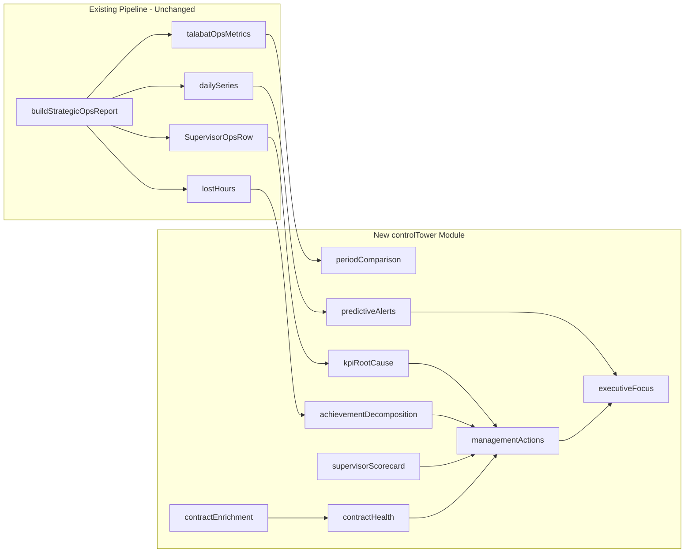

# Control Tower Implementation Plan

**Date:** 2026-06-24  
**Prerequisite:** [`STRATEGIC_CONTROL_TOWER_GAP_ANALYSIS.md`](./STRATEGIC_CONTROL_TOWER_GAP_ANALYSIS.md)  
**Policy:** Additive analytics only — no changes to Talabat formulas, Google Sheets structure, salary, or recruitment logic

---

## Objective

Transform the Strategic Operations Center from a batch reporting dashboard into an **Operational Control Tower** that explains **why** performance is happening and **what actions** management should take — while preserving all existing KPI calculations and audit capabilities.

---

## Implementation Principles

1. **New modules, not formula edits** — all logic in `lib/strategicOps/controlTower/`
2. **Extend, don't replace** — add `controlTower?: ControlTowerReport` to `StrategicOpsReport`; existing fields unchanged
3. **Compose from existing aggregates** — use outputs of `computeFleetTalabatMetrics`, `SupervisorOpsRow`, `lostHours`, `dailySeries` as inputs
4. **Single API response** — extend `GET /api/admin/strategic-ops` payload (same route, additive JSON)
5. **Action-first UI** — Control Tower sections default visible at top; audit sections remain collapsible
6. **Deterministic rules only** — no LLM dependency for management actions or predictions
7. **Trust gating** — respect `kpiTrust.disableStiOrpsGrowthRoadmap`; disable forecasts when data quality is insufficient

---

## Architecture



---

## Module Structure

```
lib/strategicOps/controlTower/
  types.ts                    # ControlTowerReport and sub-types
  periodComparison.ts         # 7/14/30-day delta vs current period
  kpiRootCause.ts             # Per-KPI driver trees + top-10 contributors
  achievementDecomposition.ts # gap hours/riders/shifts + ranked loss
  managementActions.ts        # Priority, impact, action, recovery hours
  supervisorScorecard.ts      # Unified rankings + bottom-performer diagnostics
  contractEnrichment.ts       # Read-only rider→contract join from Shifts data
  contractHealth.ts           # 0-100 score + classification + root causes
  predictiveAlerts.ts         # Linear trend extrapolation + scenario alerts
  executiveFocus.ts           # Top-10 ranked actions aggregator
  index.ts                    # buildControlTowerReport() orchestrator
  controlTower.test.ts        # Unit tests for scoring and ranking logic
```

### Type definitions (`types.ts`)

```typescript
export type ActionPriority = 'critical' | 'high' | 'medium' | 'low';

export type ManagementAction = {
  id: string;
  priority: ActionPriority;
  entityType: 'supervisor' | 'contract' | 'rider' | 'zone' | 'fleet';
  entityId: string;
  entityName: string;
  problemAr: string;
  actionAr: string;
  expectedRecoveryHours: number;
  evidence: string;
};

export type KpiTrendComparison = {
  kpiKey: string;
  kpiLabelAr: string;
  current: number;
  prior7: number | null;
  prior14: number | null;
  prior30: number | null;
  delta7: number | null;
  delta14: number | null;
  delta30: number | null;
  deltaPercent7: number | null;
  deltaPercent14: number | null;
  deltaPercent30: number | null;
};

export type KpiRootCause = {
  kpiKey: string;
  kpiLabelAr: string;
  summaryAr: string;
  factors: Array<{ labelAr: string; value: number | string; impactAr: string }>;
  topSupervisors: Array<{ code: string; name: string; contribution: number }>;
  topCities: Array<{ zone: string; contribution: number }>;
  topContracts: Array<{ contract: string; contribution: number }>;
  trend: KpiTrendComparison;
};

export type AchievementDecomposition = {
  achievementPercent: number;
  gapHoursDaily: number;
  gapRidersDaily: number;
  gapShiftsTotal: number;
  topSupervisorsByLoss: Array<{ code: string; name: string; lostTargetHoursDaily: number }>;
  topRidersByLoss: Array<{ code: string; name: string; lostHoursDaily: number }>;
  topContractsByLoss: Array<{ contract: string; lostTargetHoursDaily: number }>;
};

export type SupervisorScorecard = {
  code: string;
  name: string;
  region: string;
  teamSize: number;
  activeRiders: number;
  noShowPercent: number;
  achievementPercent: number;
  utilizationPercent: number;
  lostHoursDaily: number;
  lostTargetDaily: number;
  scorecardRank: number;
  bottomPerformerDiagnosis?: {
    whyAr: string;
    missingAr: string;
    fixAr: string;
  };
};

export type ContractHealthEntry = {
  contractName: string;
  healthScore: number;
  classification: 'excellent' | 'good' | 'risk' | 'critical';
  classificationLabelAr: string;
  achievementPercent: number;
  utilizationPercent: number;
  noShowRate: number;
  riderCount: number;
  rootCauses: Array<{ labelAr: string; value: string }>;
};

export type PredictiveAlert = {
  severity: 'red' | 'yellow' | 'green';
  messageAr: string;
  metric: string;
  currentValue: number;
  projectedValue: number;
  horizonDays: number;
  confidence: 'high' | 'medium' | 'low';
};

export type ControlTowerReport = {
  executiveFocus: ManagementAction[];
  predictiveAlerts: PredictiveAlert[];
  kpiRootCauses: KpiRootCause[];
  achievementDecomposition: AchievementDecomposition;
  supervisorScorecards: {
    topPerformers: SupervisorScorecard[];
    bottomPerformers: SupervisorScorecard[];
    all: SupervisorScorecard[];
  };
  contractHealth: {
    coveragePercent: number;
    unmappedRiderCount: number;
    contracts: ContractHealthEntry[];
  };
  periodComparisons: KpiTrendComparison[];
  generatedAt: string;
};
```

---

## Sprint Plan

### Sprint 1 — Foundation (Phases 1 + 6 partial)

**Duration:** 5–7 days  
**Goal:** Per-KPI root cause, period comparison, achievement decomposition

#### Backend tasks

**1. `periodComparison.ts`**

Compute prior-window metrics from already-loaded `dailySeries` and scoped aggregates — **do not** call `buildStrategicOpsReport` 3×.

```typescript
// Input: current period metrics + dailySeries + prior daily slices
// Output: KpiTrendComparison[] for 7 KPIs
const PRIOR_WINDOWS = [7, 14, 30] as const;
// For each KPI: current, prior7, prior14, prior30, delta, deltaPercent
```

Algorithm:
- Slice `dailySeries` to days `[startDate - N, startDate - 1]` for each window
- Recompute fleet KPIs on slice using existing `aggregateTalabatFromDailySeries()` (read-only call, same inputs)
- Compare to current period values

**2. `achievementDecomposition.ts`**

```typescript
gapHoursDaily = targetHours - actualHours;
gapRidersDaily = headcount - activeRiders;
gapShiftsTotal = sum(dailySeries, d => max(0, d.scheduledRiders - d.activeRiders));

lostTargetHoursDaily(supervisor) = max(0, supervisorTarget - supervisorActual);

// Rank top 10 supervisors, riders, contracts by lost hours
```

**3. `kpiRootCause.ts`**

For each of 7 KPIs, attach:
- `summaryAr` — template-based narrative using fleet metrics
- `factors[]` — top 3 drivers (e.g., for Achievement: gap hours, inactive riders, no-show rate)
- `topSupervisors[]` — ranked by KPI-specific loss contribution
- `topCities[]` — aggregate supervisor metrics by `region`
- `topContracts[]` — empty until Sprint 4; populate when enrichment available
- `trend` — from `periodComparison`

**4. Wire into `buildReport.ts`**

At end of pipeline (after `aiInsights`):

```typescript
const controlTower = buildControlTowerReport({
  report: partial,
  filters,
  // pass pre-computed slices, not re-fetch sheets
});
return { ...partial, operationalFormulaAudit, aiInsights, controlTower };
```

#### UI tasks (`app/admin/strategic-ops/page.tsx`)

- Add section **"برج المراقبة — التركيز اليوم"** at top (placeholder list until Sprint 2)
- Extend `TalabatKpiCard` with collapsible **"لماذا؟"** panel showing root cause summary + trend chips (7/14/30)
- Add **Achievement Decomposition** panel with top-10 supervisor/rider tables
- Add Arabic labels to `lib/strategicOps/labelsAr.ts`

#### Performance

- Cache key extension: `strategic-ops:{dates}:{zone}:{supervisor}:{scope}:{talabat}:controlTower:v1`
- Target: <15s additional compute on top of existing build

#### Sprint 1 acceptance criteria

- [ ] Each of 7 KPIs shows why summary + top 3 factors
- [ ] 7/14/30-day trend deltas visible on KPI cards
- [ ] Achievement panel shows gap hours, gap riders, gap shifts
- [ ] Top 10 supervisors and riders by lost target hours displayed
- [ ] Talabat KPI numeric values unchanged for same inputs (regression test)

---

### Sprint 2 — Management Actions + Executive Focus (Phases 2 + 6)

**Duration:** 3–4 days  
**Goal:** Structured action queue with priority and recovery hours

#### Backend — `managementActions.ts`

Deterministic rule engine (no LLM):

| Signal source | Condition | Action template | Priority |
|---------------|-----------|-----------------|----------|
| Supervisor no-show | `noShowRiders > fleetAvg + 2σ` | "اتصل بالمشرف {name} اليوم — {n} no-show" | Critical if n > 15, else High |
| Supervisor achievement gap | `lostTargetDaily > 20` | "المشرف {name} يفقد {h} ساعة/يوم" | High |
| Inactive riders by supervisor | `inactiveRiders > 5` | "تفعيل {n} طيار غير نشط تحت {name}" | Medium |
| Headcount gap | `activeRiders < headcount * 0.7` | "تعيين مطلوب — {n} طيار" | High |
| Resignation spike | `resignations > 3 in period` | "تدخل احتفاظ — {n} إقالة" | Medium |
| Fleet no-show trend | `deltaPercent7 > 10%` | "ارتفاع No Show — مراجعة الحضور" | High |
| Bottom supervisor scorecard | Bottom 5 performers | "خطة تحسين للمشرف {name}" | Critical/High |

Recovery hours calculation:

```typescript
// No-show recovery: noShowCount * avgHoursPerActiveRider
// Inactive recovery: inactiveCount * 6 (hours/day baseline from growth scenario C)
// Achievement gap: lostTargetHoursDaily directly
```

Each action shape:

```typescript
{
  id: 'sup-no-show-123',
  priority: 'critical',
  entityType: 'supervisor',
  entityId: '123',
  entityName: 'Ahmed Hassan',
  problemAr: 'المشرف لديه 18 no-show يومياً',
  actionAr: 'اتصل بالمشرف اليوم وفعّل خطة حضور',
  expectedRecoveryHours: 72,
  evidence: 'noShowRiders=18, fleetAvg=8, σ=3'
}
```

#### Backend — `executiveFocus.ts`

```typescript
function buildExecutiveFocus(actions: ManagementAction[]): ManagementAction[] {
  return [...actions]
    .sort((a, b) => b.expectedRecoveryHours - a.expectedRecoveryHours)
    .slice(0, 10);
}
```

#### UI tasks

- Replace Sprint 1 placeholder with ranked action cards
- Priority badges: Critical (red), High (orange), Medium (yellow), Low (gray)
- Show `+{N} hours` recovery prominently
- Copy button for supervisor contact list (WhatsApp-ready text)

#### Sprint 2 acceptance criteria

- [ ] ≥5 auto-generated actions on typical 30-day report
- [ ] Each action has priority, problem, action, recovery hours
- [ ] Executive focus shows ≤10 actions sorted by recovery hours
- [ ] Actions visible without expanding strategic sections

---

### Sprint 3 — Supervisor Scorecards (Phase 3)

**Duration:** 2–3 days  
**Goal:** Unified scorecards with bottom-performer diagnosis

#### Backend — `supervisorScorecard.ts`

Analytics-only computed fields (do not modify `computeSupervisorRisk()`):

```typescript
lostHoursDaily = max(0, (headcount * HOURS_CAP) - dailyHours) / operationalDays;
lostTargetDaily = max(0, targetDaily - dailyHours);
noShowPercent = (noShowRiders / headcount) * 100;
scorecardRank = rank by composite(achievement, utilization, inverse noShow, inverse lostTarget);
```

Bottom performer diagnosis templates:

```typescript
if (noShowPercent > 15) {
  whyAr = 'معدل No Show مرتفع';
  missingAr = `${noShowRiders} طيار لا يحضر يومياً`;
  fixAr = 'تفعيل خطة حضور يومية + متابعة هاتفية';
} else if (utilizationPercent < 60) {
  whyAr = 'استغلال منخفض للفريق';
  missingAr = `${inactiveRiders} طيار غير نشط`;
  fixAr = 'تفعيل الطيارين غير النشطين + مراجعة التوزيع';
}
// ... additional rules
```

#### UI tasks

- New section: **"بطاقات أداء المشرفين"**
- Tabs: Top 5 Performers | Bottom 5 Performers
- Bottom performers expand to show why / missing / fix
- Table columns: Rank, Name, Team, Active, No Show %, Achievement, Utilization, Lost Hours, Lost Target

#### Sprint 3 acceptance criteria

- [ ] Scorecards include all 7 required metrics
- [ ] Top 5 and Bottom 5 rankings displayed
- [ ] Bottom performers show diagnosis (why, missing, fix)
- [ ] Rankings consistent with existing supervisor table data

---

### Sprint 4 — Contract Health (Phase 4)

**Duration:** 4–5 days (depends on join coverage)  
**Goal:** Per-contract health score with classification and root causes

#### Step 4A — Data audit (read-only)

New script: `scripts/audit-rider-contract-coverage.ts`

```
1. Load المناديب codes
2. Load Shifts employee roster (employee_id, contract_name)
3. Match rider.code ↔ employee_id (exact + normalized)
4. Report: match rate overall, by zone, unmatched samples
5. Output: docs/enterprise-readiness/CONTRACT_JOIN_COVERAGE_REPORT.md
```

#### Step 4B — `contractEnrichment.ts`

```typescript
// Read-only from Shifts spreadsheet via getShiftsSpreadsheetId()
// Map: riderCode → contractName
// Unmapped → 'Unknown'
// NO writes to any sheet
```

#### Step 4C — `contractHealth.ts`

Health score (0–100) weighted composite:

| Component | Weight | Source |
|-----------|--------|--------|
| Achievement | 30% | Contract-aggregated actual/target hours |
| Utilization | 25% | active / headcount per contract |
| Attendance (inverse no-show) | 20% | 100 - noShowRate |
| Stability (inverse attrition) | 15% | resignations / headcount |
| Data quality | 10% | mapped rider % for contract |

Classification:

| Score | Label | Arabic |
|-------|-------|--------|
| 85–100 | Excellent | ممتاز |
| 70–84 | Good | جيد |
| 50–69 | Risk | خطر |
| 0–49 | Critical | حرج |

Root causes: contract-level aggregation of lost hours categories (no operation, weak, resignations).

#### UI tasks

- Contract health grid with color-coded classification badges
- Drill-down: click contract → see riders, supervisors, root causes
- Display coverage banner: "X% of riders mapped to contracts"

#### Sprint 4 acceptance criteria

- [ ] Contract join coverage documented (target: >80% for production use)
- [ ] Health score computed for all mapped contracts
- [ ] Classification bands applied correctly
- [ ] Root causes shown per contract
- [ ] Unmapped riders disclosed with count

---

### Sprint 5 — Predictive Alerts (Phase 5)

**Duration:** 2–3 days  
**Goal:** Forward-looking alerts based on trend extrapolation

#### Backend — `predictiveAlerts.ts`

**Method:** Simple linear regression on last 14 days of `dailySeries` (respect trust gating).

Alert templates:

| Template | Condition | Message example |
|----------|-----------|-----------------|
| Weekly miss | Negative hours slope | "إذا استمر الاتجاه، العقد {X} سيفقد {H} ساعة هذا الأسبوع" |
| Achievement forecast | Declining achievement | "إذا بقي No Show كما هو، التحقيق ينخفض إلى {Y}%" |
| Reactivation scenario | inactiveRiders > 10 | "إذا عاد {N} طيار غير نشط، التحقيق يصبح {Z}%" |
| No-show spike | 7-day delta > 10% | "No Show ارتفع {X}% — توقع فقد {H} ساعة/أسبوع" |

Return shape:

```typescript
{
  severity: 'red' | 'yellow' | 'green',
  messageAr: string,
  metric: 'hours' | 'achievement' | 'noShow' | 'utilization',
  currentValue: number,
  projectedValue: number,
  horizonDays: 7,
  confidence: 'high' | 'medium' | 'low'  // based on R² of regression
}
```

Disable when `kpiTrust.disableStiOrpsGrowthRoadmap === true`.

#### UI tasks

- Alert banner strip above KPI cards (max 8 visible, "show all" expand)
- Color-coded by severity
- Dismiss per session (localStorage, not persisted server-side)

#### Sprint 5 acceptance criteria

- [ ] ≥3 alerts generated when trends are declining
- [ ] Alerts disabled when KPI trust level gates forecasts
- [ ] Each alert shows current vs projected value
- [ ] Arabic messages match operations director language

---

### Sprint 6 — Polish + Phase 7 Fixes

**Duration:** 2 days  
**Goal:** Production hardening, export, monitoring fixes

#### Tasks

1. **CSP fix** — `lib/securityHeaders.ts`: add Sentry to `connect-src` OR enable `tunnelRoute: '/monitoring'` in `next.config.js`
2. **ErrorBoundary Sentry** — `components/ErrorBoundary.tsx`: add `Sentry.captureException(error)` in `componentDidCatch`
3. **Export** — `lib/strategicOps/clientExport.ts`: add Control Tower sheets (Executive Focus, Scorecards, Contract Health, Alerts)
4. **Load test** — extend `scripts/load-test-strategic-ops.ts` with authenticated build including control tower
5. **Labels** — complete Arabic labels in `labelsAr.ts`
6. **Unit tests** — `controlTower.test.ts` for ranking, scoring, action generation

#### Sprint 6 acceptance criteria

- [ ] Sentry client events not blocked by CSP (verified in Network tab)
- [ ] Control Tower sections exportable to Excel
- [ ] Load test documents P95 with control tower enabled
- [ ] All Arabic labels present

---

## Files to Modify

| File | Change type | Description |
|------|-------------|-------------|
| `lib/strategicOps/controlTower/*` | **New** | All control tower modules |
| `lib/strategicOps/buildReport.ts` | Extend | Import `buildControlTowerReport`, add to return type |
| `app/admin/strategic-ops/page.tsx` | Extend | Control Tower UI sections (default visible) |
| `lib/strategicOps/clientExport.ts` | Extend | Export new sections |
| `lib/strategicOps/labelsAr.ts` | Extend | Arabic labels |
| `lib/securityHeaders.ts` | Fix | CSP for Sentry |
| `components/ErrorBoundary.tsx` | Fix | Sentry capture |
| `next.config.js` | Optional | Sentry tunnel route |
| `scripts/audit-rider-contract-coverage.ts` | **New** | Contract join audit |
| `scripts/load-test-strategic-ops.ts` | Extend | Authenticated control tower test |

## Files Explicitly NOT Modified

| File | Reason |
|------|--------|
| `lib/strategicOps/talabatOpsMetrics.ts` | Talabat formula parity |
| `lib/googleSheets.ts` (write paths) | No Sheet changes |
| `lib/recruitment/recruitmentService.ts` | Recruitment logic |
| Salary modules | Salary calculations |
| Sheet tab structures | Data source integrity |

---

## API Contract Extension

**Endpoint:** `GET /api/admin/strategic-ops` (unchanged)

**New response field:**

```json
{
  "success": true,
  "data": {
    "...existing StrategicOpsReport fields...",
    "controlTower": {
      "executiveFocus": [...],
      "predictiveAlerts": [...],
      "kpiRootCauses": [...],
      "achievementDecomposition": {...},
      "supervisorScorecards": {...},
      "contractHealth": {...},
      "periodComparisons": [...],
      "generatedAt": "2026-06-24T10:00:00.000Z"
    }
  }
}
```

Backward compatible: clients ignoring `controlTower` continue to work.

---

## Testing Strategy

| Level | Scope | Tool |
|-------|-------|------|
| Unit | Scoring, ranking, action rules, trend math | `controlTower.test.ts` |
| Integration | Full report build with control tower | Existing strategic ops tests + snapshot |
| Regression | Talabat KPI values unchanged | Compare pre/post outputs for fixed fixtures |
| Performance | Build time with control tower | `scripts/load-test-strategic-ops.ts` |
| UAT | Browser console, CSP, Sentry | [`CONSOLE_ERROR_AUDIT.md`](./CONSOLE_ERROR_AUDIT.md) checklist |
| Data | Contract join coverage | `scripts/audit-rider-contract-coverage.ts` |

---

## Rollout Plan

| Stage | Environment | Action |
|-------|-------------|--------|
| 1 | Local dev | Sprint 1–3 behind feature flag `CONTROL_TOWER_ENABLED=true` |
| 2 | Preview | Contract audit + full control tower |
| 3 | Preview UAT | Operations director review (Arabic copy, action relevance) |
| 4 | Production | Enable flag; monitor Sentry + build times |
| 5 | Production +1 week | Remove flag; control tower always on |

Feature flag (optional):

```typescript
// lib/strategicOps/buildReport.ts
if (process.env.CONTROL_TOWER_ENABLED === 'true') {
  controlTower = buildControlTowerReport(...);
}
```

---

## Risk Register

| Risk | Likelihood | Impact | Mitigation |
|------|------------|--------|------------|
| Contract join coverage < 50% | Medium | High | Disclose coverage; use supervisor proxy fallback |
| Build time exceeds 120s | Medium | High | Prior-window compute from cached dailySeries; extend cache TTL |
| Action rules generate noise | Medium | Medium | Tune thresholds with ops director; cap at 10 in executive focus |
| Arabic copy misaligned with ops language | Low | Medium | UAT with Arabic-speaking director before production |
| CSP fix breaks other integrations | Low | High | Test all connect-src targets; prefer Sentry tunnel |

---

## Effort Summary

| Sprint | Scope | Effort | Dependencies |
|--------|-------|--------|--------------|
| 1 | Root cause + period comparison + achievement UI | 5–7 days | None |
| 2 | Management actions + executive focus | 3–4 days | Sprint 1 |
| 3 | Supervisor scorecards | 2–3 days | Sprint 1 |
| 4 | Contract enrichment + health | 4–5 days | Contract audit script |
| 5 | Predictive alerts | 2–3 days | Sprint 1, trust gating |
| 6 | CSP/Sentry + export + load test | 2 days | All sprints |
| **Total** | | **18–24 dev days** | |

---

## Global Acceptance Criteria

- [ ] Each of 7 KPIs shows: why, top 3 factors, top supervisors/cities, 7/14/30-day trend
- [ ] Achievement view shows gap hours/riders/shifts + top 10 loss lists
- [ ] ≥5 auto-generated management actions with priority + recovery hours
- [ ] Supervisor scorecards with top/bottom 5 + bottom diagnosis
- [ ] Contract health for all mapped contracts (or documented coverage %)
- [ ] ≥3 predictive alerts when trends are declining
- [ ] Executive focus shows ≤10 ranked actions
- [ ] Zero changes to Talabat KPI numeric outputs for same inputs
- [ ] All existing audit sections preserved and accessible
- [ ] CSP/Sentry client monitoring functional

---

## Sign-off

| Role | Action |
|------|--------|
| Operations Director | Review action templates and Arabic copy (Sprint 2 UAT) |
| Engineering | Implement sprints 1–6 per this plan |
| Data | Run contract join audit before Sprint 4 |
| DevOps | Verify CSP fix + Sentry in production |

**Document status:** Implementation plan complete — ready for sprint execution upon approval.
