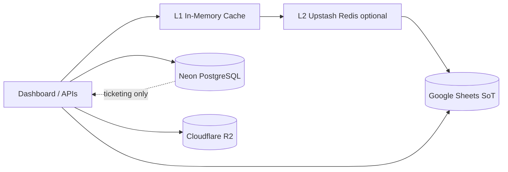
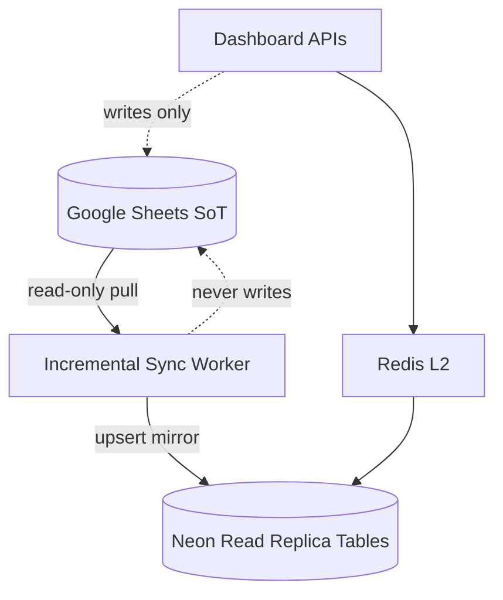

# Google Sheets Scalability Architecture (Phase 4F)

**Date:** 2026-06-23  
**Status:** **IMPLEMENTED** — not activated. See [NEON_READ_REPLICA_IMPLEMENTATION.md](./NEON_READ_REPLICA_IMPLEMENTATION.md).
**Policy:** Google Sheets remains source of truth forever. No data migration. No automatic activation.

---

## Current architecture



| Layer | Role today |
|-------|------------|
| Google Sheets | **Primary SoT** — riders, performance, salaries, strategic ops inputs |
| Neon | Ticketing module only (`TICKETING_DATABASE_URL`) |
| Redis | Optional read-through cache (not yet in production) |
| R2 | Ticketing attachments |

### Current bottlenecks

| Issue | Impact |
|-------|--------|
| Sheets API latency | 500ms–5s per tab read |
| `البيانات اليومية` ~58k rows | Full-tab reads on cache miss |
| Serverless L1 isolation | Cache not shared across Vercel instances |
| Sheets quota | 300 read requests/minute per project (shared) |

---

## Future architecture: Sheets → Sync → Neon Read Replica



### Principles

| Rule | Detail |
|------|--------|
| Sheets | **Forever SoT** — all writes go to Sheets first |
| Neon mirror | **Read replica only** — denormalized tables for queries |
| Sync | Incremental, idempotent, reversible |
| Activation | Feature flag `NEON_READ_REPLICA_ENABLED=false` (default) |
| Rollback | Disable flag → APIs read Sheets directly (today's path) |

---

## Proposed mirror tables (additive)

| Mirror table | Source sheet | Sync strategy |
|--------------|--------------|---------------|
| `mirror_riders` | المناديب | Row hash diff |
| `mirror_daily_performance` | البيانات اليومية | Date + rider incremental |
| `mirror_supervisors` | المشرفين | Full tab hash |
| `mirror_salary_config` | إعدادات_الرواتب | Hash diff |

**No ticketing data in mirror** — ticketing stays on existing Neon tables.

---

## Sync worker design

```
1. Read sheet version / max(updated_at) watermark from Sheets (read-only)
2. Compare with mirror_sync_state table in Neon
3. Fetch only changed rows (or date window for daily performance)
4. UPSERT into mirror_* tables
5. Invalidate Redis cache prefixes
6. Log sync_run to mirror_audit_log
```

| Property | Value |
|----------|-------|
| Frequency | Every 5–15 minutes (cron) |
| Writes to Sheets | **Never** |
| Reversible | `DROP mirror_*` + disable flag |
| Conflict resolution | Sheets always wins |

---

## Migration risk

| Risk | Level | Mitigation |
|------|-------|------------|
| Data drift mirror vs Sheets | Medium | Hash audit job, Sheets wins |
| Accidental Sheets write from sync | High | Read-only Google credentials for sync SA |
| Dual code paths | Medium | Feature flag, shared query interface |
| Neon cost growth | Low | Indexed tables, row pruning by date |

---

## Rollback plan

1. Set `NEON_READ_REPLICA_ENABLED=false` on Vercel.
2. Redeploy — APIs use existing `getSheetData()` path.
3. Optionally `DROP TABLE mirror_*` (ticketing tables unaffected).
4. Sheets data **unchanged** — zero rollback risk to SoT.

---

## Expected latency improvements (when activated)

| Operation | Today (Sheets) | With Neon mirror |
|-----------|----------------|------------------|
| Dashboard load | 2–8 s | 200–800 ms |
| Riders list | 1–5 s | 50–300 ms |
| Strategic Ops report | 10–60 s | 2–15 s |
| Salary calculation | 5–20 s | 1–5 s |

Combined with Redis L2: additional **40–70%** reduction on repeat reads.

---

## Scalability estimates

Assumes current architecture (Sheets direct) vs future (mirror + Redis).

### Riders in system

| Scale | Sheets-only max | With mirror + Redis | Notes |
|-------|----------------|---------------------|-------|
| **1k riders** | ✅ Comfortable | ✅ Excellent | Current ~433 riders |
| **5k riders** | ⚠️ Slow reports | ✅ Good | Daily sheet ~200k rows/year |
| **10k riders** | ❌ Strategic Ops timeout risk | ✅ Acceptable | Needs mirror |
| **25k riders** | ❌ Not viable on Sheets reads | ⚠️ Needs partitioning | Mirror + date partitions |

### Daily performance rows (annual)

| Riders | Rows/year | Sheets read time (full tab) |
|-------:|----------:|----------------------------|
| 1k | ~365k | ~3–8 s cached / 15–30 s cold |
| 5k | ~1.8M | Exceeds practical Sheets tab size |
| 10k | ~3.6M | **Requires mirror** |
| 25k | ~9M | **Requires mirror + archival strategy** |

---

## Implementation phases (not executed)

| Phase | Action | Auto? |
|-------|--------|-------|
| F1 | This document | Done |
| F2 | `mirror_*` DDL (idempotent) | **Done** — `npm run migrate:mirror` |
| F3 | Sync worker script | **Done** — `npm run sync:mirror` |
| F4 | Read adapter with feature flag | **Done** — `getSheetData` + `NEON_READ_REPLICA_ENABLED` |
| F5 | Staging validation | Manual |
| F6 | Production enable | **Explicit admin approval** |

---

## Sign-off

| Requirement | Met |
|-------------|-----|
| Sheets remains SoT | Yes (by design) |
| No data migration in this phase | Yes |
| No automatic activation | Yes |
| Architecture documented | Yes |
| Rollback plan | Yes |
