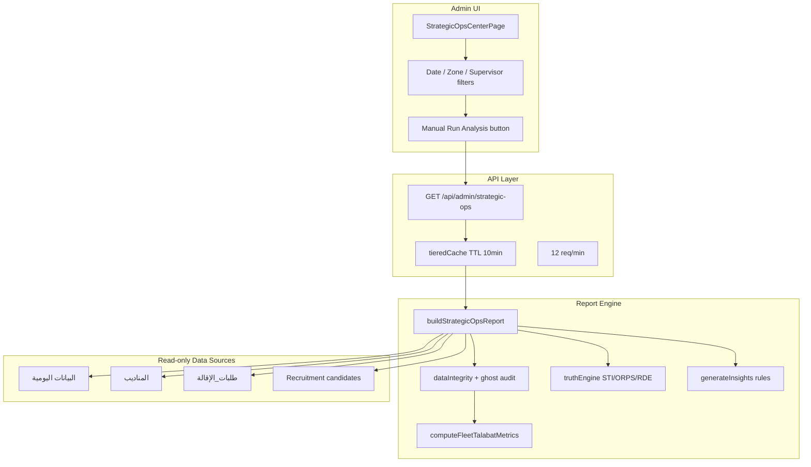
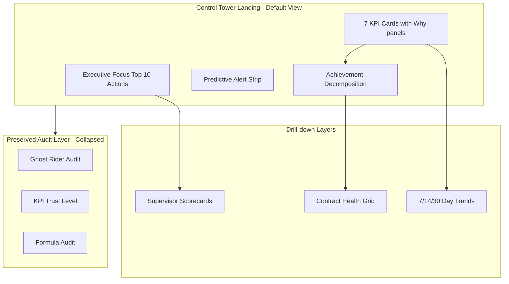

# Strategic Control Tower — Gap Analysis

**Date:** 2026-06-24  
**Audience:** Logistics Operations Leadership (Talabat, 5,000+ riders)  
**Scope:** Strategic Operations Center (`/admin/strategic-ops`) vs. Operational Control Tower requirements  
**Constraint:** Read-only audit — no business logic, Google Sheets, Talabat formulas, salary, or recruitment changes

---

## Executive Summary

The current **Strategic Operations Center** (Arabic: مركز العمليات الاستراتيجي) is a **batch reporting and data-trust audit platform**. It reliably answers **what happened** in a selected date range with deep formula traceability. It does **not** systematically answer:

- **Why** is each KPI at its current value?
- **Who** owns the loss (supervisor, contract, city, rider)?
- **What** should management do today, with expected recovery?
- **What happens** if current trends continue?

For a fleet of 5,000+ riders across multiple cities, this gap forces directors to manually interpret tables, export to Excel, or copy reports to external tools — turning the SOC into a reporting dashboard rather than an operational control tower.

### Verdict

| Dimension | Current maturity | Control tower target |
|-----------|------------------|----------------------|
| KPI visibility | Strong (8 Talabat KPIs + audit traces) | Met |
| Root cause per KPI | Weak (formula only) | **Gap — Critical** |
| Management action queue | None | **Gap — Critical** |
| Supervisor intelligence | Partial (table + STI/ORPS) | **Gap — High** |
| Contract health | Not implemented | **Gap — Critical** |
| Predictive alerts | Risk flags only | **Gap — High** |
| Executive focus (top 10 actions) | Narrative paragraph | **Gap — Critical** |
| Live operations | Manual "Run Analysis" | **Gap — High** |

---

## System Inventory (Current State)

### Architecture



### Primary code paths

| Layer | File | Role |
|-------|------|------|
| UI | `app/admin/strategic-ops/page.tsx` | ~1,400 lines; inline `StatCard`, `TalabatKpiCard`, `Section`, charts |
| API | `app/api/admin/strategic-ops/route.ts` | Auth, cache, Sentry span, `maxDuration: 120s` |
| Orchestrator | `lib/strategicOps/buildReport.ts` | `StrategicOpsReport`, `buildStrategicOpsReport()` |
| Talabat KPIs | `lib/strategicOps/talabatOpsMetrics.ts` | Fleet/supervisor metrics, audit traces |
| Truth engine | `lib/strategicOps/truthEngine.ts` | STI, ORPS, dependency, 4 alert types |
| Labels | `lib/strategicOps/labelsAr.ts` | Arabic section titles |
| Export | `lib/strategicOps/clientExport.ts` | Excel/PDF export |

### KPIs displayed (Talabat Operations — default mode)

| KPI | Field | Definition (unchanged) |
|-----|-------|------------------------|
| Headcount | `talabatOperations.headcount` | Registered riders in scope |
| Active Riders | `talabatOperations.activeRiders` | Avg daily riders with hours > 0 |
| No Show | `talabatOperations.noShowRiders` | Avg daily on operational days |
| Actual Hours | `talabatOperations.actualHours` | Avg daily fleet hours |
| Target Hours | `talabatOperations.targetHours` | Avg daily supervisor targets (fallback 1500) |
| Achievement % | `talabatOperations.achievementPercent` | actualHours / targetHours × 100 |
| Avg Hours/Active Rider | `talabatOperations.avgHoursPerActiveRider` | actualHours / activeRiders |
| Utilization % | `talabatOperations.utilizationPercent` | activeRiders / headcount × 100 |

Each KPI has an expandable **audit trace** (formula, numerator, denominator, source sheet) — this explains **how the number is calculated**, not **why performance is low**.

### Supporting analytics (mostly hidden)

Default UI mode is `talabat_ops`. Deep analytics require toggling **"Show Strategic Analysis"** or switching to `strategic_full`:

| Section | Capability | Control tower relevance |
|---------|------------|-------------------------|
| Lost hours | 3 fleet categories (no operation, weak operation, resignations) | Partial root cause |
| Supervisor performance | Table with KPI columns | No loss ranking |
| Supervisor risk | Risk score + factors | Not action-oriented |
| STI / ORPS / RDE | Truth intelligence rankings | Data quality focus |
| Growth scenarios A–D | What-if hour gains | Not predictive alerts |
| AI insights | 7 Arabic text blocks | Unstructured, no priority/recovery |
| Operational health | Fleet score 0–100 | Not per-contract or per-KPI |
| Ghost/join-date audits | Data trust forensics | Important but not ops actions |

### Data dimensions available (read-only)

| Dimension | Status | Notes |
|-----------|--------|-------|
| **Supervisor** | Full aggregation | `supervisorPerformance.rows`, STI, ORPS, risk |
| **City/Zone** | Filter only | `lib/zones.ts` — 7 zones; no side-by-side rollup table |
| **Contract** | **Absent** | Exists in Shifts module (`contract_name`, `employee_id`) — not wired to Strategic Ops |
| **Rider** | Partial | Top/bottom 20 by hours; no KPI drill-down |
| **Shift** | **Absent** | Shifts module isolated from Strategic Ops KPIs |
| **Time** | User-selected range | No automatic 7/14/30-day prior comparison |

**Rider model** (`lib/adminService.ts`) fields: `code`, `name`, `region`, `supervisorCode`, `phone`, `joinDate`, `status` — **no contract field**.

---

## Phase-by-Phase Gap Analysis

### Phase 1 — Root Cause Analysis (per KPI)

**Requirement:** For every KPI, explain why it is at its value, top contributing factors, top supervisors/contracts/cities, and trend vs previous 7/14/30 days.

**Example (Achievement = 66%):** Dashboard must explain missing hours, missing riders, missing shifts, top 10 contracts/supervisors/riders causing loss.

| Requirement | Current capability | Gap severity |
|-------------|-------------------|--------------|
| Why is KPI at this value? | Formula audit trace on `TalabatKpiCard` | **High** — calculation ≠ causation |
| Top contributing factors | Fleet lost-hours has 3 categories only | **High** — no per-KPI driver tree |
| Top supervisors | Supervisor table exists; not ranked by loss contribution | **High** |
| Top contracts | Not available — no contract dimension | **Critical** |
| Top cities | Zone filter only; no city rollup or ranking | **High** |
| Trend vs 7/14/30 days | User picks arbitrary range | **High** — no auto prior-period delta |
| Achievement decomposition | Partial: `hoursRoadmap.dailyGap`, `bottom20ByHours` | **Critical** — no gap riders/shifts, no top-10 loss lists |

**Code evidence — achievement is a ratio only:**

```typescript
// lib/strategicOps/talabatOpsMetrics.ts
achievementPercent = pct(actualHours, targetHours);
// Missing: gapHours, gapRiders, gapShifts, ranked contributors by entity
```

**Reusable building blocks (no formula changes needed):**

- `SupervisorOpsRow` — headcount, active, no-show, hours, achievement, utilization (`buildReport.ts` L91–123)
- `utilization.top20ByHours` / `bottom20ByHours` — rider rankings
- `lostHours.breakdown` — 3-category fleet loss
- `talabatOperations.dailySeries` — per-day active, no-show, hours, target

**Phase 1 gap score: 35/100**

---

### Phase 2 — Management Actions

**Requirement:** For every detected problem, generate priority (Critical/High/Medium/Low), expected recovered hours, and recommended action.

| Requirement | Current | Gap |
|-------------|---------|-----|
| Priority classification | None | **Critical** |
| Expected recovered hours | Growth scenarios have hours; not tied to actions | **High** |
| Recommended action | `aiInsights` = unstructured Arabic prose | **High** |
| Structured action queue | None | **Critical** |
| Assignable / trackable items | None | **Critical** |

**Current `generateInsights()` output** (`buildReport.ts` L1011–1056):

- `biggestProblem`, `lostHoursCause`, `supervisorNeedingIntervention`, `underutilizedRiders`, `focusThisWeek`, `focusThisMonth`, `fastestHourGains`
- All plain strings — no `{ priority, impact, action, recoveryHours }` schema

**Example of what's missing:**

```
Supervisor Ahmed has 18 no-shows
Priority: Critical
Action: Call supervisor today
Expected recovery: +72 hours
```

**Phase 2 gap score: 15/100**

---

### Phase 3 — Supervisor Performance Intelligence

**Requirement:** Supervisor scorecards with team size, active riders, no-show %, achievement %, utilization %, lost hours, lost target; top/bottom rankings with diagnosis for bottom performers.

| Requirement | Current | Gap |
|-------------|---------|-----|
| Scorecard metrics | Table has most KPIs | **Medium** — missing lost hours & lost target per supervisor |
| Top performers ranking | `bestSupervisor` by `productivityScore` | **Medium** — separate from STI/ORPS |
| Bottom performers ranking | `worstSupervisor` by productivityScore | **Medium** |
| Bottom performer diagnosis (why / missing / fix) | `supervisorRisk.factors` partial | **High** — no dedicated narrative |
| Unified scorecard view | None | **High** |

**Existing supervisor fields** (`SupervisorOpsRow`): headcount, activeRiders, noShowRiders, dailyHours, achievementPercent, utilizationPercent, productivityScore, riskScore — but **no `lostHoursDaily` or `lostTargetDaily`**.

**Phase 3 gap score: 45/100**

---

### Phase 4 — Contract Health

**Requirement:** Health score 0–100 per contract based on achievement, utilization, attendance, no-show, stability; classification (Excellent/Good/Risk/Critical); root causes.

| Requirement | Current | Gap |
|-------------|---------|-----|
| Per-contract health score | None | **Critical** |
| Classification bands | Fleet `operationalHealth` only | **Critical** |
| Root causes per contract | None | **Critical** |
| Contract KPI rollup | None in Strategic Ops | **Critical** |

**Data prerequisite:** Contract dimension requires read-only enrichment:

- Shifts/Rooster export: `employee_id`, `contract_name` (`lib/shiftAutomationLegacy.ts`)
- Join: rider code ↔ employee_id (coverage unknown — requires audit script)
- Fallback: supervisor/zone proxy until join validated

**Phase 4 gap score: 0/100**

---

### Phase 5 — Predictive Alerts

**Requirement:** Forward-looking alerts such as "Contract A will miss target by 220 hours this week" or "If 15 inactive riders return, achievement becomes 79%."

| Requirement | Current | Gap |
|-------------|---------|-----|
| Trend extrapolation (hours) | `hoursRoadmap` = static daily gap | **High** |
| No-show trend → achievement forecast | Not implemented | **High** |
| Reactivation scenario alerts | Growth scenario C (manual, not alert) | **Medium** |
| Weekly miss projection | Not implemented | **High** |

**Existing alerts** (`truthEngine.ts` — `TruthCriticalAlert`):

- `supervisor_collapse_risk`, `over_dependency`, `ghost_leakage_spike`, `single_point_of_failure`
- These are **risk flags**, not **predictive forecasts**

**Phase 5 gap score: 20/100**

---

### Phase 6 — Executive Summary ("Where should management focus today?")

**Requirement:** Maximum 10 actions ranked by business impact with recoverable hours.

| Requirement | Current | Gap |
|-------------|---------|-----|
| Ranked action list (≤10) | None | **Critical** |
| Recoverable hours per action | Not quantified in UI | **Critical** |
| Default landing prominence | KPI cards + supervisor table | **Critical** — actions buried |
| Single-glance ops briefing | `aiInsights.focusThisWeek` = paragraph | **Critical** |

**UX issue:** Directors landing on `/admin/strategic-ops` see KPIs and a supervisor table. The closest equivalent to "focus today" is section 12 (AI insights), hidden behind strategic toggle.

**Phase 6 gap score: 10/100**

---

### Phase 7 — Technical Audit (Console Errors)

Covered in [`CONSOLE_ERROR_AUDIT.md`](./CONSOLE_ERROR_AUDIT.md).

**Key finding:** Content Security Policy in `lib/securityHeaders.ts` omits Sentry ingest domains — client error monitoring likely fails silently when DSN is configured.

---

## Cross-Cutting Structural Gaps

| # | Gap | Impact on 5,000+ rider operations |
|---|-----|-------------------------------------|
| 1 | Manual "Run Analysis" button | Not a live control tower; stale by default |
| 2 | 30–120s report build time | Directors cannot refresh during morning standup |
| 3 | Reporting-first IA | 15+ audit sections vs. 1 action-first landing |
| 4 | No KPI → contributor drill-down | Cannot click Achievement 66% → see top loss drivers |
| 5 | Shifts module isolated | Contract/shift gaps invisible in Strategic Ops |
| 6 | Talabat benchmark = manual input | Accuracy score requires typing external values |
| 7 | No zone comparison grid | Cannot compare Alexandria vs Nasr City side-by-side |
| 8 | Rule insights labeled "AI" | Sets false expectation; no generative explanation |
| 9 | Strategic depth gated behind toggle | Critical ops intelligence hidden by default |
| 10 | No bridge to ticketing | Detected problems don't create trackable tickets |

---

## Strengths to Preserve

The existing platform has enterprise-grade capabilities that must **not** be regressed:

1. **Talabat formula parity** — audit traces match operational definitions
2. **Ghost rider forensics** — root-cause categories A–E with leakage quantification
3. **KPI Trust Level (1–4)** — gates unreliable forecasts when data quality is poor
4. **Final KPI Accuracy Audit** — executive trust score
5. **Supervisor truth indices** — STI, ORPS, rider dependency (RDE)
6. **Export pipeline** — Excel/PDF for executive review
7. **Zone-scoped admin access** — multi-city security model
8. **Tiered cache + Sentry spans** — production observability hooks

---

## Gap Summary Matrix

| Phase | Name | Gap score | Priority |
|-------|------|-----------|----------|
| 1 | Root Cause Analysis | 35/100 | P0 |
| 2 | Management Actions | 15/100 | P0 |
| 3 | Supervisor Scorecards | 45/100 | P1 |
| 4 | Contract Health | 0/100 | P0 |
| 5 | Predictive Alerts | 20/100 | P1 |
| 6 | Executive Focus | 10/100 | P0 |
| 7 | Console/CSP Audit | See separate doc | P0 (Sentry) |

**Overall control tower readiness: ~25/100**

---

## Target State (Control Tower)



---

## Data Dimension Constraints

### Supervisor — Ready

Full aggregation pipeline exists. Enhancement = add loss ranking and scorecard fields (analytics-only, no formula change).

### City/Zone — Partial

- 7 zones in `lib/zones.ts`: Ain shams, Alexandria, El rehab city, Heliopolis, Mansoura, Nasr city, Tagammoa golden square
- Used as filter on `rider.region` / `supervisor.region`
- **Needed:** Zone rollup table aggregating same KPIs as fleet level

### Contract — Blocked pending enrichment

- Source: Shifts spreadsheet (`GOOGLE_SHEETS_SHIFTS_SPREADSHEET_ID`)
- Fields: `employee_id`, `contract_name`, `city`
- Join key: rider `code` ↔ `employee_id` (match rate TBD)
- **No Google Sheet modification** — read-only join at report build time
- Unmapped riders → `"Unknown"` bucket with coverage % disclosed

### Shift coverage — Proxy available

- `TalabatDailySnapshot.scheduledRiders` vs `activeRiders` per day
- Can proxy "missing shifts" as `scheduledRiders - activeRiders` aggregated over period
- Full shift integration deferred (Shifts module remains separate)

---

## Recommendations (Analysis Only — No Implementation)

1. **Reframe the landing page** from "Run Analysis" report to "Control Tower — Focus Today"
2. **Add analytics layer** under `lib/strategicOps/controlTower/` composing existing aggregates
3. **Audit contract join coverage** before Phase 4 commitment
4. **Fix CSP/Sentry** before relying on client error monitoring (Phase 7)
5. **Keep all audit sections** but collapse behind "Data Trust" accordion

See [`CONTROL_TOWER_IMPLEMENTATION_PLAN.md`](./CONTROL_TOWER_IMPLEMENTATION_PLAN.md) for sprint-level roadmap.

---

## Appendix A — Strategic Ops Report Sections (Full Inventory)

| # | Section key | Arabic label | Default visible |
|---|-------------|--------------|-----------------|
| — | talabatOperations | وضع عمليات Talabat | Yes |
| — | talabatAccuracyScore | TALABAT ACCURACY SCORE | Yes |
| — | supervisorPerformance | أداء المشرفين | Yes |
| 1 | executiveSummary | الملخص التنفيذي | Hidden |
| 2 | activityDistribution | توزيع نشاط الطيارين | Hidden |
| 3 | utilization | تحليل الاستغلال | Hidden |
| 4 | hoursAnalysis | تحليل الساعات | Hidden |
| 5 | lostHours | تحليل الساعات المهدرة | Hidden |
| 6 | supervisorPerformance | (duplicate label) | Partial |
| 7 | supervisorRisk | تحليل مخاطر المشرفين | Hidden |
| 8 | recruitment | تحليل التعيين | Hidden |
| 9 | attrition | تحليل التسرب | Hidden |
| 10 | growthOpportunities | فرص النمو | Hidden |
| 11 | hoursRoadmap | خارطة 2200 ساعة | Hidden |
| 12 | aiInsights | رؤى الإدارة | Hidden |
| — | operationalTruthIntelligence | ذكاء الحقيقة التشغيلية | Hidden |
| — | dataIntegrity / ghost / join-date audits | Multiple | Hidden |

---

## Appendix B — Sign-off

| Question | Answer |
|----------|--------|
| Is the SOC sufficient as a control tower today? | **No** |
| Can gaps be closed without changing Talabat formulas? | **Yes** — analytics layer only |
| Is contract health feasible without Sheet changes? | **Yes** — read-only Shifts join (coverage TBD) |
| Highest-priority gap? | Executive focus + per-KPI root cause + management actions |

**Document status:** Gap analysis complete — ready for implementation planning.
